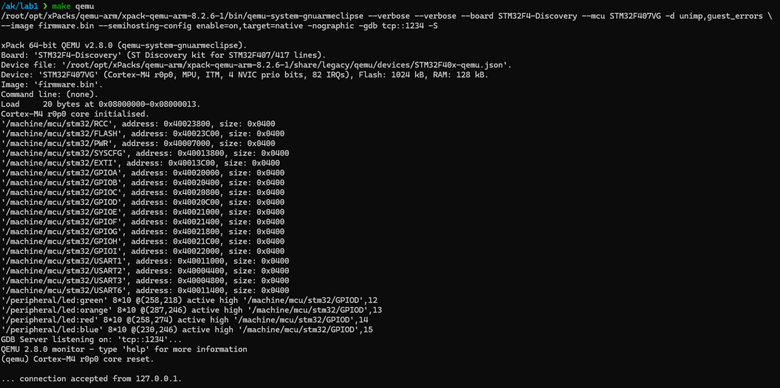
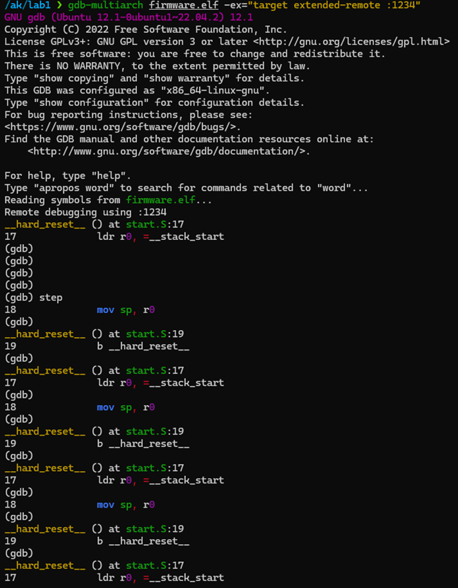

# Архітектура комп’ютерів 3. Мікропроцесорні системи  
## Лабораторна робота №1  
### Виконав: Прохоренко Артем Дмитрович, ІО-23

---

У цій лабораторній роботі було реалізовано мінімальний проєкт на мові асемблера для архітектури ARM Cortex-M4 (STM32F407VG). Проєкт містить таблицю векторів, процедуру ініціалізації стеку та безперервне виконання інструкції переходу.

Було виконано:  
- Створення вихідних файлів `start.S` та `lscript.ld` згідно методичних вказівок  
- Складання прошивки за допомогою `Makefile`  
- Запуск прошивки в емуляторі QEMU  
- Відлагодження за допомогою `gdb-multiarch`  

---

## Файли проєкту  
- `start.S` — стартовий код  
- `lscript.ld` — лінкерний скрипт  
- `Makefile` — автоматизація збірки та запуску  

---

## Результати виконання

[**Відеозапис виконання**](https://drive.google.com/file/d/1yoy0X_mYvDfXeDoUizs1sL8or50D6yji/view?usp=sharing)

---

## Висновок  

У ході лабораторної роботи було встановлено усе необхідне ПЗ та створено мінімальний проєкт на мові асемблера для архітектури Cortex-M4, зібрано прошивку, а також успішно запущено її у середовищі емулятора QEMU з відлагодженням через GDB. Робота дозволила закріпити базові навички створення прошивки, роботи з лінкерним скриптом, а також відлагодження у середовищі QEMU.

